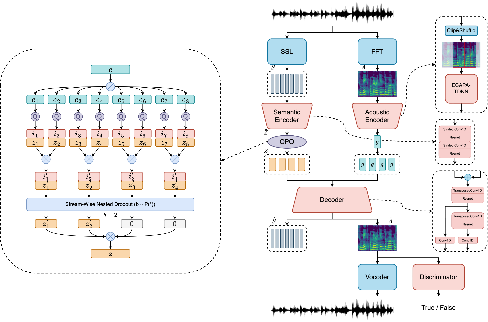

## SoCodec: A Semantic-Ordered Multi-Stream Speech Codec for Efficient Language Model based Text-To-Speech Synthesis

#### **Haohan Guo**, Fenglong Xie, Kun Xie, Dongchao Yang, Dake Guo, Xixin Wu, Helen Meng

This repository contains inference scripts for SoCodec, an ultra-low-bitrate speech codec, dedicated to speech language models, introduced in the paper titled **SoCodec: A Semantic-Ordered Multi-Stream Speech Codec for Efficient Language Model based Text-To-Speech Synthesis**.

 [Paper](https://arxiv.org/abs/2409.00933) <br>
📈 [Demo Site](https://hhguo.github.io/DemoSoCodec)<br>
⚙ [Model Weights](https://huggingface.co/hhguo/SoCodec)

👉 With SoCodec, you can compress **audio** into discrete codes at an **ultra low 0.47 kbps bitrate** and a **short 120ms frameshift**.  <br>
👌 It can be used as a drop-in replacement for EnCodec or other multi-stream codecs for speech language modeling applications. <br>
📚 The released checkpoint only supports **Chinese** now. The training of the multi-lingual version is in progress.<br>

<center></center>

## News
- **Sep 2024 (v1.0):**
  - We have released the checkpoint and inference code of SoCodec
  <!-- - We have released the test set for Socodec, available [**here**](https://hhguo.github.io/DemoSoCodec) -->

## Installation

Clone the repository and install dependencies:

```shell
git clone https://github.com/hhguo/SoCodec
cd SoCodec
mkdir ckpts && cd ckpts
wget https://huggingface.co/TencentGameMate/chinese-hubert-large/resolve/main/chinese-hubert-large-fairseq-ckpt.pt
wget https://huggingface.co/hhguo/SoCodec/resolve/main/socodec_16384x4_120ms_16khz_chinese.safetensors
wget https://huggingface.co/hhguo/SoCodec/resolve/main/mel_vocoder_80dim_10ms_16khz.safetensors
```

## Usage

```shell
# For analysis-synthesis
python example.py -i ground_truth.wav -o synthesis.wav
# For speech analysis
python example.py -i ground_truth.wav -o features.pt
# For token-to-audio synthesis
python example.py -i features.pt -o synthesis.wav
```

## Pretrained Models

We provide the [pretrained models](https://huggingface.co/hhguo/SoCodec) on Hugging Face Collections.

| Model Name                                                                                               | Frame Shift | Codebook Size | Number of Streams | Dataset |
|:--------------------------------------------------------------------------------------------------------:|:-------------:|:--------:|:-----:|:----------------:|
| [socodec_16384x4_120ms_16khz_chinese](https://huggingface.co/hhguo/SoCodec/resolve/main/socodec_16384x4_120ms_16khz_chinese.safetensors)             | 120ms        | 16384      | 4 | WenetSpeech4TTS |
<!-- | [socodec_16384x1_40ms_16khz_chinese](https://huggingface.co/nvidia/bigvgan_v2_44khz_128band_256x)             | 120ms        | 16384      | 4 | WenetSpeech4TTS | -->

We also provide the [pretrained vocoders](https://huggingface.co/hhguo/SoCodec) to convert the Mel spectrogram from socodec to the waveform.

| Model Name                                                                                               | Frame Shift | Mel Bins | fmax  | Upsampling Ratio | Dataset |
|:--------------------------------------------------------------------------------------------------------:|:-------------:|:--------:|:-----:|:----------------:|:--------------------------:|
| [mel_vocoder_80dim_10ms_16khz](https://huggingface.co/hhguo/SoCodec/resolve/main/mel_vocoder_80dim_10ms_16khz.safetensors)             | 16 kHz        | 80      | 8000 | 160 | WenetSpeech4TTS |

## TODO

- [ ] Provide the checkpoint and inference code of multi-stream LLM
- [ ] Provide the single-codebook version
- [ ] Provide a higher-quality neural vocoder
- [ ] Provide a multi-lingual version (Chinese, English, etc.)

## References

- [BigVGAN](https://github.com/NVIDIA/BigVGAN)
- [DAC](https://raw.githubusercontent.com/descriptinc/descript-audio-codec)
- [ChineseHuBERT](https://github.com/TencentGameMate/chinese_speech_pretrain)